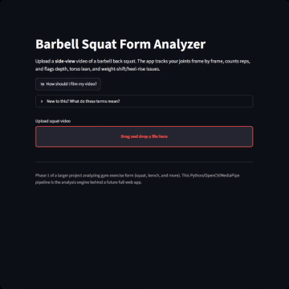

# Squat Analyzer

Computer-vision squat form coach: upload a side-view video of a barbell back
squat, and it tracks your joints frame-by-frame, counts your reps, and gives
you specific feedback on depth, torso lean, and weight-shifting/heel-rise —
the same cues a coach would give you, generated automatically from pose
estimation.

This is **Phase 1** of a larger project analyzing form across gym exercises
(squat, bench press, deadlift, and more). See [Roadmap](#roadmap).

## Demo



```
python main.py sample_videos/my_squat.mp4
```

```
3 rep(s) detected over 12.4s at 30.0 fps

Rep 1: min knee angle 88°, max torso lean 32°
  - Good rep: solid depth, upright torso, and stable feet.

Rep 2: min knee angle 118°, max torso lean 29°
  - Didn't quite hit depth: knee angle only reached 118°. Aim for thighs
    at least parallel to the floor (roughly 100° or less).

Rep 3: min knee angle 91°, max torso lean 51°
  - Torso leans forward about 51° from vertical near the bottom. Brace
    your core and try to keep your chest up through the descent.

Annotated video saved to sample_videos/my_squat_annotated.mp4
```

Or run the browser demo:

```
streamlit run app.py
```

## How it works

```
video file
    │
    ▼
OpenCV frame reader (auto-corrects portrait/rotated phone video) ──────┐
    │                                                                  │
    ▼                                                                  │
MediaPipe PoseLandmarker (BlazePose "heavy", 33 landmarks)             │
    │  detects multiple people, keeps the largest (the actual lifter)  │
    │  picks the more-visible body side for a side-view video          │
    │  falls back to the ear if the shoulder is occluded (e.g. by a    │
    │  plate) but the ear is still visible                             │
    ▼                                                                  │
smoothing.py — rolling median filter per joint                        │
    │  rejects single-/few-frame position jitter from low-contrast    │
    │  footage without discarding or freezing a joint                 │
    ▼                                                                  │
angles.py — joint angles from 2D landmark coordinates                 │
    │  knee angle, hip angle, torso lean from vertical,                │
    │  knee-over-toe & heel-rise ratios (normalized by                 │
    │  thigh length, so they hold up across camera distances)          │
    ▼                                                                  │
rep_counter.py — hysteresis state machine over knee angle              │
    │  groups frames into individual reps, filters out noise           │
    ▼                                                                  │
feedback.py — rule-based form checks per rep                          │
    │  depth / torso lean / weight-shift, in plain English             │
    ▼                                                                  │
video_processor.py — skeleton overlay + live feedback ─────────────────┘
    │
    ▼
annotated video + structured report (CLI, JSON, or Streamlit UI)
```

## Project layout

```
angles.py            Pure geometry: joint angles from 2D points
pose_estimator.py     MediaPipe PoseLandmarker wrapper: landmark extraction,
                       side/subject picking, ear-for-shoulder fallback
smoothing.py            Rolling median filter over each joint's position
config.py                Tunable thresholds (depth, lean, rep-detection)
metrics.py                 FrameMetrics dataclass (per-frame angles/ratios)
rep_counter.py               State machine that groups frames into reps
feedback.py                    Rule-based form checks -> RepReport per rep
video_processor.py               Orchestrates the pipeline; draws overlay video
filming_guide.py                   Builds the in-app "how to film" diagram
main.py                              CLI entry point
app.py                                Streamlit browser demo
tests/                                  Unit tests
docs/                                     README images/GIFs
sample_videos/                              Drop your own test clips here (gitignored)
```

`plate_detector.py` and `visibility_gate.py` (with their tests) are also in
the repo but **not currently wired into the pipeline** — both were tried as
fixes for plate/shadow occlusion and empirically made hip tracking *worse*
on real footage (see [Design notes](#design-notes)), so they were pulled out
of `video_processor.py` and kept only as a record of what was tried.

## Getting started

Requires **Python 3.10 or 3.11** (MediaPipe's official wheels lag behind the
newest Python releases, so a slightly older interpreter avoids install
headaches).

```bash
python -m venv .venv
.venv\Scripts\activate        # Windows
# source .venv/bin/activate   # macOS/Linux

pip install -r requirements.txt

# Analyze a video from the command line
python main.py path\to\your_squat.mp4

# Or launch the browser demo
streamlit run app.py

# Run the test suite
pytest
```

The first run of `main.py` or `app.py` downloads MediaPipe's
`pose_landmarker_heavy` model (~31 MB) into a local `models/` folder —
that's expected, one-time, and requires an internet connection.

## Design notes

A few deliberate choices worth calling out (also useful context if you're
reviewing this as a portfolio project):

- **Side view only, by design.** A single 2D camera can't reliably measure
  depth (z-axis) or knee valgus (inward knee cave), which need a front view.
  Rather than fake precision there, Phase 1 sticks to what a side view can
  actually measure well: knee/hip flexion, torso lean, and heel position.
- **Ratios instead of raw pixels.** Knee-over-toe distance and heel rise are
  normalized by thigh length (hip-to-knee pixel distance) in the same frame,
  so the same squat filmed close-up or far away produces the same numbers.
- **No "knee past toe = bad" rule.** That's a common but outdated cue —
  forward knee travel is normal and often necessary (high-bar squats,
  taller lifters). It's only surfaced as context when heels are also
  lifting, which is the actual sign of weight shifting onto the toes.
- **Hysteresis, not a single threshold, for rep counting.** Using separate
  "enter squat" and "return to standing" thresholds (with a minimum
  knee-angle drop to count as a real rep) avoids miscounting a knee wobble
  or weight shift as a rep. A descent also only counts as a rep attempt if
  the knee angle held near full extension for a minimum duration right
  beforehand (`MIN_STANDING_DURATION_S`) — otherwise a video that opens
  mid-motion, or a quick bend while unracking, could get treated as a rep.
- **`pose_landmarker_heavy`, not `full`.** MediaPipe's confidence/visibility
  score turned out to be a poor proxy for whether a landmark's *position*
  was actually correct — tested against real footage where a plate covering
  the hip, or shadows on black shoes against a black lifting mat, produced
  confidently-wrong joint positions rather than low-confidence ones. A/B
  testing the two model variants against that footage showed `heavy` cuts
  the worst sustained hip misdetection roughly in half (and clears it
  entirely for some joints), at the cost of ~2.3x the inference time and a
  larger download.
- **Median smoothing, tuned against real footage, not guessed.** A rolling
  median filter (`smoothing.py`) rejects a joint jittering by several pixels
  between frames — common in the same low-contrast conditions above — without
  freezing or discarding the frame. The window size is a deliberate,
  measured trade-off between lag and correction, not a default left
  untouched; see the docstring in `smoothing.py` for the numbers.
- **Ear, not nose, as the shoulder fallback.** When a plate occludes the
  shoulder landmark, the ear is used in its place if it's still visible —
  chosen over the nose because it has a true left/right pair and sits more
  in line with the shoulder-hip axis, so it distorts the lean/angle math
  less.
- **Two things that were tried and reverted, on purpose.** A Hough-circle
  plate detector and a per-joint visibility gate (freeze-until-confident)
  both sounded reasonable but made real footage worse when actually tested:
  the circle detector would lock onto the wrong circle in a busy gym
  background, and the visibility gate produced a visible "hip shoots out"
  snap once occlusion (which is usually sustained, not a single flickered
  frame) ended. Both are kept in the repo, unused, as a record of a
  disproven approach rather than deleted and forgotten.

## Limitations (honest, current state)

- Side-view only; can't detect knee valgus, bar path drift, or spinal
  rounding (would need a front view and/or more landmarks).
- Hip/heel tracking under heavy shadow or a large plate occluding the torso
  is improved but not fully solved — expect occasional brief glitches in
  those conditions even with the current model + smoothing settings.
- Thresholds in `config.py` are reasonable defaults, not personalized or
  validated against a labeled dataset of real coaching calls.
- Rep detection is angle-based, so a partial/failed rep with a big knee bend
  could be counted; there is no barbell tracking yet to corroborate depth.

## Roadmap

- [x] **Phase 1 — Squat, side view (this repo):** pose tracking, angle math,
      rep counting, rule-based feedback, CLI + Streamlit demo.
- [ ] **Phase 2 — More exercises & views:** bench press, deadlift; front-view
      checks (knee valgus, bar path); a labeled test set to tune thresholds
      instead of hand-picked defaults.
- [ ] **Phase 3 — Full web app:** FastAPI backend wrapping this analysis
      engine, React/Next.js frontend, video upload + history, responsive
      layout for mobile and desktop.
- [ ] **Phase 4 — Mobile-first:** on-device inference (MediaPipe Tasks /
      TF Lite) for near-real-time feedback while filming, not just after.

## License

MIT — see [LICENSE](LICENSE).
